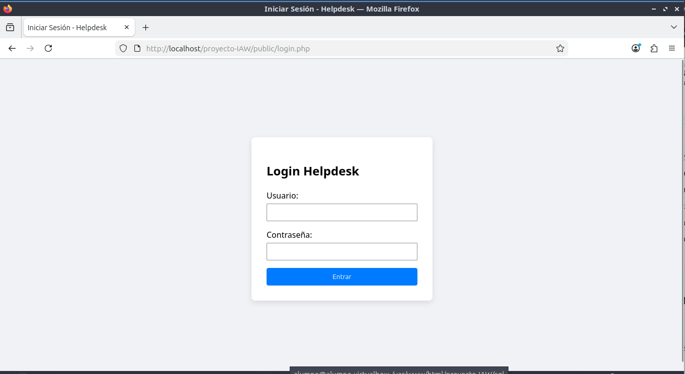
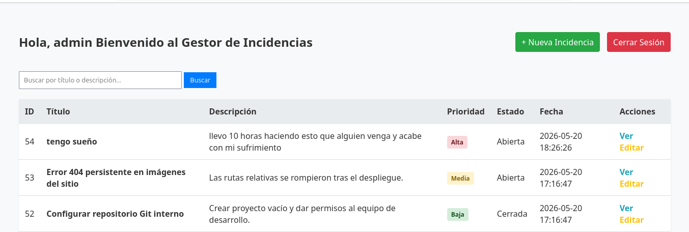
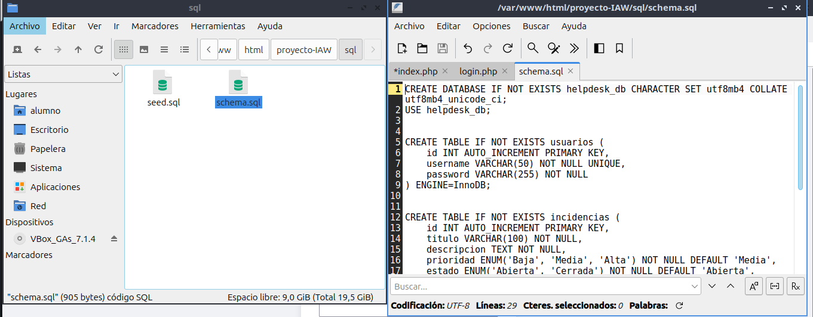
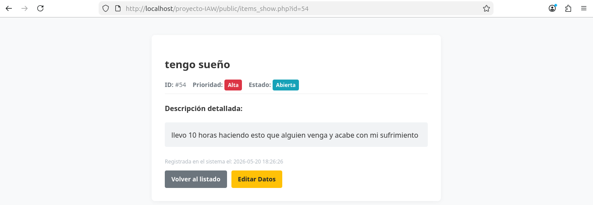

# Sistema Helpdesk - Gestión de Incidencias

Proyecto desarrollado para la asignatura de **Despliegue de Aplicaciones Web (IAW)** de 2º de ASIR 
Adrian Garcia Carbonell 
Jesus Maria Ortega Abril 

## Funcionalidades del Sistema
* **Autenticación:** Control de acceso mediante sesiones seguras con PHP.
* **Paginación:** Visualización optimizada de registros cargados de 10 en 10.
* **Buscador:** Filtrado de texto mediante consultas preparadas (PDO) en MySQL.
* **Seguridad:** Implementación de tokens CSRF y mitigación de XSS.

---

## Capturas del Funcionamiento

### 1. Formulario de Autenticación (Login)
Formulario de entrada inicial que valida credenciales encriptadas en la base de datos.



### 2. Panel de Control y Listado
Muestra la tabla principal con las incidencias paginadas y el buscador operativo.


### 3. Validación de Errores (Lado Servidor)
Control de campos vacíos obligatorios antes de insertar datos en MySQL.


### 4. Vista de Detalle de Incidencia
Ficha completa con la información extendida de un ticket técnico.


---

## Comandos para el Despliegue

Para desplegar este proyecto en un servidor local, ejecuta:

```bash
# 1. Clonar el repositorio en el servidor web
git clone https://github.com/tu-usuario/proyecto-IAW.git

# 2. Importar la base de datos
mysql -u helpdesk_user -p < sql/schema.sql
mysql -u helpdesk_user -p < sql/seed.sql
